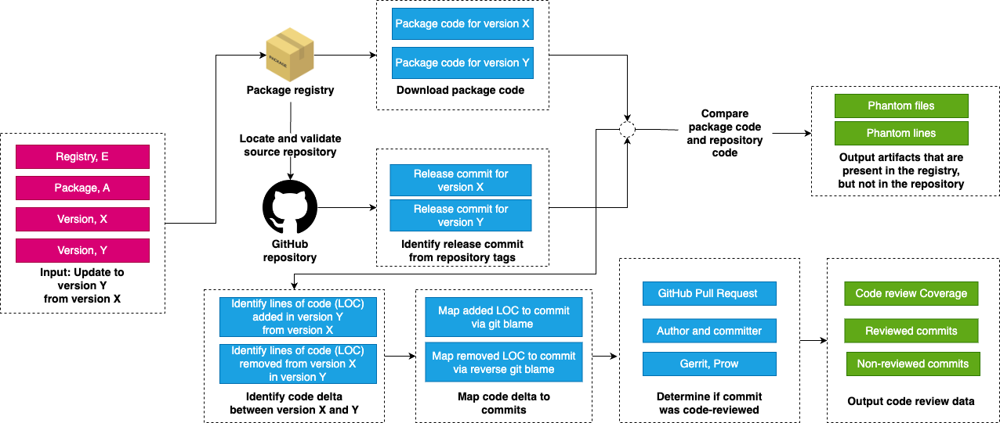

Depdive
===========================
|PyPI| |Python Version| |License| |Read the Docs| |Build| |Tests| |Codecov| |pre-commit| |Black|

.. |PyPI| image:: https://img.shields.io/pypi/v/depdive.svg
   :target: https://pypi.org/project/depdive/
   :alt: PyPI
.. |Python Version| image:: https://img.shields.io/pypi/pyversions/depdive
   :target: https://pypi.org/project/depdive
   :alt: Python Version
.. |License| image:: https://img.shields.io/github/license/nasifimtiazohi/depdive
   :target: https://opensource.org/licenses/MIT
   :alt: License
.. |Read the Docs| image:: https://img.shields.io/readthedocs/depdive/latest.svg?label=Read%20the%20Docs
   :target: https://depdive.readthedocs.io/
   :alt: Read the documentation at https://depdive.readthedocs.io/
.. |Build| image:: https://github.com/nasifimtiazohi/depdive/workflows/Build%20depdive%20Package/badge.svg
   :target: https://github.com/nasifimtiazohi/depdive/actions?workflow=Package
   :alt: Build Package Status
.. |Tests| image:: https://github.com/nasifimtiazohi/depdive/workflows/Run%20depdive%20Tests/badge.svg
   :target: https://github.com/nasifimtiazohi/depdive/actions?workflow=Tests
   :alt: Run Tests Status
.. |Codecov| image:: https://codecov.io/gh/nasifimtiazohi/depdive/branch/master/graph/badge.svg
   :target: https://codecov.io/gh/nasifimtiazohi/depdive
   :alt: Codecov
.. |pre-commit| image:: https://img.shields.io/badge/pre--commit-enabled-brightgreen?logo=pre-commit&logoColor=white
   :target: https://github.com/pre-commit/pre-commit
   :alt: pre-commit
.. |Black| image:: https://img.shields.io/badge/code%20style-black-000000.svg
   :target: https://github.com/psf/black
   :alt: Black
   
  

Each time you accept a dependency update, you are pulling in new third-party code. However, how to ensure the update is secure? 

One way to put a security (and quality) control check before accepting an update is to check what part of the code changes has passed through a code review process. Depdive automates this check.

Workflow
--------

Depdive maps code changes between two versions of a package uploaded in the registry to the corresponding commits that made these changes in the source repository. Depdive then identifies if there was a reviewer for the mapped commit(s) through rule-based checks for evidence of code review on GitHub.

Along the process, Depdive also outputs phantom artifacts: files and lines that are present in the registry but not present in the repository. Examples of phantom files can be compiled binaries in PyPI packages, transpiled JavaScript in npm, and other auto-generated files. Not to mention, malicious actors can sneak in code in the last mile between the repository and the registry. 

Depdive works for four package registries: (1) Crates.io (Rust), (2) npm (JavaScript), (3) PyPI (Python), and (4) RubyGems (Ruby).
Currently, Depdive only works for GitHub repositories, as GitHub is our primary source to check for code review. 

Features
--------

* Outputs changes that have (and have not) been code reviewed in a dependency update. You can calculate the code review coverage from the output by dividing the reviewed lines by the total lines of code changes in an update.
* Outputs the reviewed and non-reviewed commits. Also outputs how we determined if a commit was code-reviewed, and the actors involved in the review.
* Outputs files present in the update version downloaded from the registry but not in the source repository, ie phantom files.
* Outputs code changes that are present in the udpate, but cannot be mapped to changes in the repository, ie phantom lines.

Installation
------------

You can install *depdive* via pip_ from PyPI_:

.. code:: console

   $ pip install depdive

Usage
-----
.. code-block:: python

    ca = CodeReviewAnalysis(CARGO, "tokio", "1.8.4", "1.9.0")
    stats = ca.stats
    assert stats.phantom_files == 0
    assert stats.files_with_phantom_lines == 0
    assert stats.phantom_lines == 0
    assert stats.reviewed_lines == 3694
    assert stats.non_reviewed_lines == 0
    assert stats.total_commit_count == 29
    assert stats.reviewed_commit_count == 29
    
    ca = CodeReviewAnalysis(RUBYGEMS, "pundit", "2.1.0", "2.1.1")
    stats = ca.stats
    assert stats.phantom_files == 0
    assert stats.files_with_phantom_lines == 0
    assert stats.phantom_lines == 0
    assert stats.reviewed_lines == 128
    assert stats.non_reviewed_lines == 186
    assert stats.total_commit_count == 35
    assert stats.reviewed_commit_count == 23
    
    ca = CodeReviewAnalysis(PYPI, "numpy", "1.21.4", "1.21.5")
    stats = ca.stats
    assert stats.phantom_files == 39
    assert stats.files_with_phantom_lines == 1
    assert stats.phantom_lines == 3
    assert stats.reviewed_lines == 245
    assert stats.non_reviewed_lines == 12
    assert stats.total_commit_count == 10
    assert stats.reviewed_commit_count == 9
    
    ca = CodeReviewAnalysis(NPM, "lodash", "4.17.20", "4.17.21")
    stats = ca.stats
    assert stats.phantom_files == 1046
    assert stats.files_with_phantom_lines == 1
    assert stats.phantom_lines == 1
    assert stats.reviewed_lines == 58
    assert stats.non_reviewed_lines == 14
    assert stats.total_commit_count == 3
    assert stats.reviewed_commit_count == 2
    

Future Work
------------

* Also provide the quality of the code review(s), e.g., what is the relation between the author and the reviewer? Was a sock account used to bypass the code review check?
* What other checks should we perform for an update?

Credits
-------

This package was created with cookietemple_ using Cookiecutter_ based on Hypermodern_Python_Cookiecutter_.

.. _cookietemple: https://cookietemple.com
.. _Cookiecutter: https://github.com/audreyr/cookiecutter
.. _PyPI: https://pypi.org/
.. _Hypermodern_Python_Cookiecutter: https://github.com/cjolowicz/cookiecutter-hypermodern-python
.. _pip: https://pip.pypa.io/
.. _Usage: https://depdive.readthedocs.io/en/latest/usage.html
